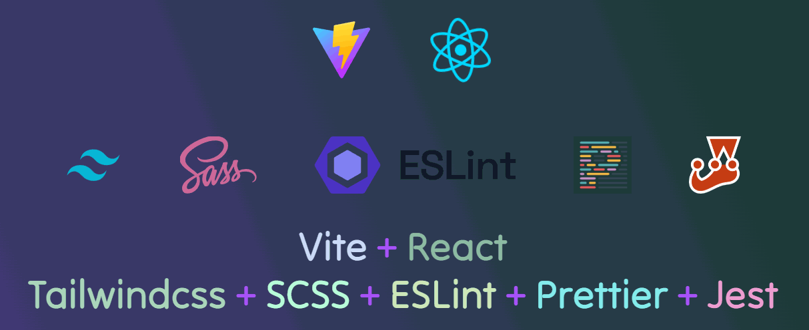

  

# Starter_Assembly
Vite + React + Tilwind-css + SCSS

Для запуска использовать следующие команды:

`npm run dev`      – Запустит проект в режиме разработки.  
`npm run serve`    – Запустит проект в режиме продакшн.  
`npm run build`    – Запустит сборку проекта. В корне проекта появится папка dist.  
`npm run preview`  – Для запуска локального предпросмотра статического сайта готовой сборки.  
`npm run test`     – Запуск тестов в проекте с использованием инструмента тестирования Jest.  
